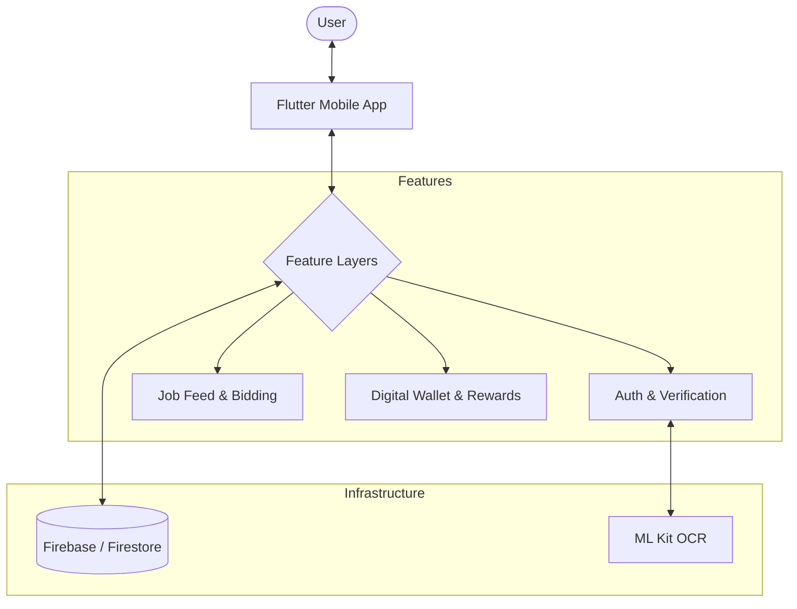

# Earnify: Freelance Marketplace & Financial Empowerment

This README is structured to directly support the preparation of the project PPT.

---

## 1. Project Objectives

- **Local Gig Discovery**: Enable real-time, proximity-based job matching for local freelancers (Helpers) and job seekers.
- **Micro-Financial Management**: Empower gig workers with robust financial tracking and budgeting tools.
- **Trust & Verification**: Bridge the trust gap in the informal sector through multi-layered verification (OCR, QR, Community Ratings).
- **Gamification**: Drive user engagement and service quality through a reward-based system (Coins/XP).

## 2. Problem Statement

- **Fragmented Market**: Local manual labor and small-scale freelance tasks often lack a centralized discovery platform.
- **Inconsistent Income tracking**: Freelancers struggle to manage multiple small streams of income and daily expenses.
- **Verification Bottlenecks**: High friction in verifying the identity and reliability of workers for domestic or small-business tasks.
- **Lack of Incentives**: No formalized way to reward consistent, high-quality work in the local gig economy.

## 3. Project Overview - Introduction

**Earnify** is a modern Flutter application designed to formalize the local gig economy. It serves as a dual-sided marketplace that not only connects workers with tasks but also acts as a digital financial tracker. Built on Firebase, Earnify ensures that every job is tracked, verified, and managed professionally.

## 4. End User

- **Helpers (Freelancers)**: Students, skilled workers, or anyone looking for part-time local gigs (delivery, shifting, cleanup, repairs).
- **Seekers (Clients)**: Homeowners, students, or small business owners needing immediate, reliable help for one-time tasks.

## 5. Wow Factor

- **Digital Wallet Integration**: A built-in system that helps you manage your budgets, earnings, and transactions seamlessly.
- **Contactless QR Workflow**: Seamless job lifecycle from scanning to payment, ensuring security and proof of work.
- **Smart Proximity Matching**: Dynamic location-aware job feeds that prioritize opportunities within the helper's immediate vicinity.
- **Verification Engine**: Edge-based ML Kit OCR for rapid document verification and trust building.

## 6. Modelling (Architecture)

### Application Architecture

### Core Modules

- **Authentication**: Google login with Document OCR.
- **Job Engine**: Real-time Firestore updates for location-based job broadcasting.
- **Finance Engine**: Robust tracking and analysis of wallet transactions and budget goals.
- **Gamification**: XP and Coin system linked to job completion and ratings.

## 7. Result / Outcomes

- **Functional Prototype**: A cross-platform mobile app (Android/iOS) supporting the full job lifecycle.
- **Automated Verification**: Reduced onboarding friction while maintaining high security.
- **Financial Literacy**: Active user feedback loop through detailed transaction histories and budgeting goals.
- **Scalable Backend**: Serverless Firebase architecture capable of handling real-time data flow.

## 8. Conclusion

Earnify transforms the way local work is found and managed. By integrating advanced tracking tools with a robust freelance marketplace, it provides a "triple-win": convenience for seekers, opportunities for helpers, and financial clarity for the gig economy.

## 9. Future Perspective

- **UPI Integration**: Direct payment settlements via UPI deep-linking.
- **Skill Badges**: Verification of specific skills (e.g., electrical, plumbing) through community certification.
- **Dynamic Pricing**: AI-suggested rates based on job complexity and local market demand.
- **Multilingual Support**: Expanding access to non-English speaking regional markets.
