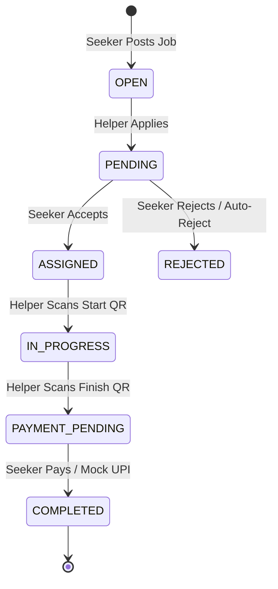
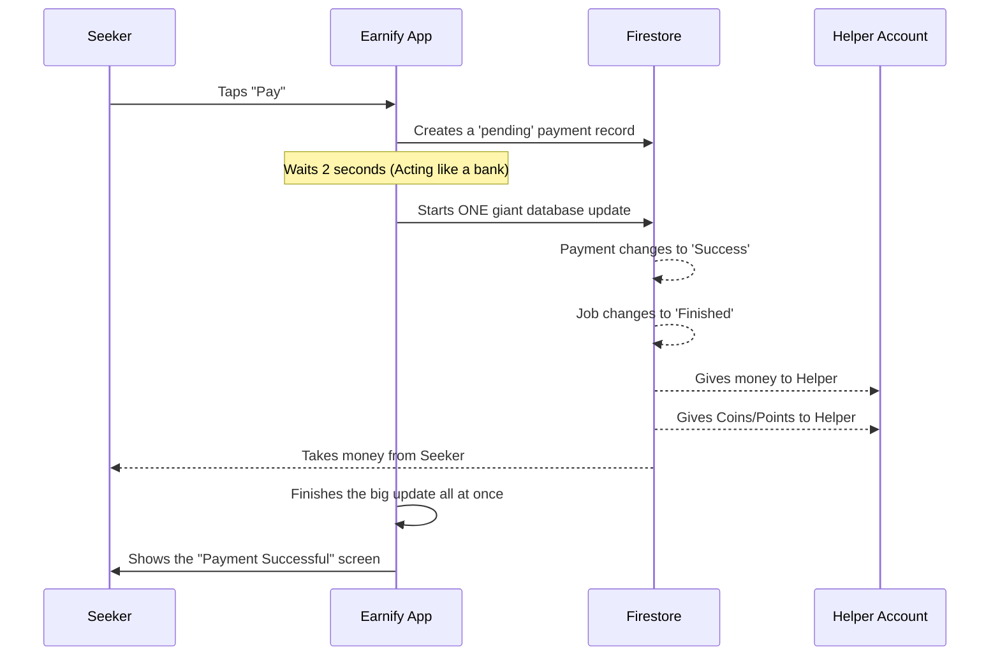
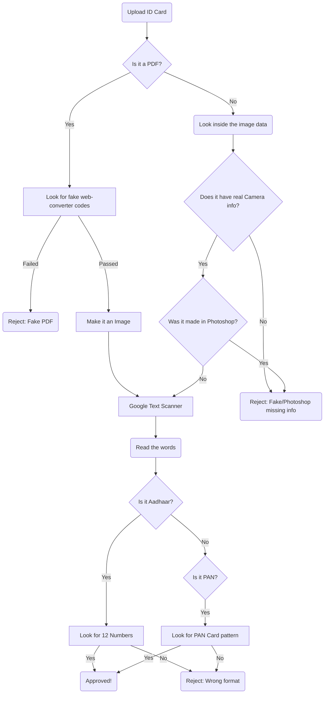

# Earnify - Simple Developer Guide

This document explains how **Earnify** (formerly Unnati) is built. It's meant to help anyone understand the "why," "how," and "where" of every part of the app.

---

## 🏗️ 1. How the App is Built (Tech Stack)

### The Phone App (Frontend)

- **Language:** Dart
- **Framework:** Flutter (v3.10+)
- **Why Flutter?** It lets us write code once and release the app on both iPhones (iOS) and Android phones at the same time. It also makes drawing nice screens and fast animations very easy.
- **How the App Remembers Things:** We use something called `Provider`. It helps different parts of the app remember information (like your wallet balance) without having to pass the data around manually.
- **Changing Screens:** We use Flutter's built-in navigation tools to move between different screens.

### The Internet Brain (Backend & Database)

- **Main Tool used:** Firebase
- **Database:** Cloud Firestore (It saves data as "documents", like digital folders, instead of traditional tables).
- **Log-in System:** Firebase Auth (Handles Email/Password and Google Sign-In).
- **Cloud Storage:** Cloudinary (Used for saving profile pictures and ID photos).
- **Why Firebase & Cloudinary?** Firebase instantly updates the app when data changes on the internet, and Google manages all the login security for us. We use Cloudinary to save images because it automatically crops and shrinks pictures to save internet data and money.

---

## 🎭 2. How the App Works: Seekers and Helpers

The app has two types of users:

1. **Seekers**: People who post jobs and need help.
2. **Helpers**: People who do the jobs to earn money.

### How Users Switch Roles

- **Where does it happen?** The `RoleSelectionScreen`.
- **How it works:** A user can switch between being a "Seeker" or a "Helper" by pressing a button. This saves their choice in the database.
- **Why is switching so fast?** When you switch your role (or switch tabs at the bottom of the screen), the app doesn't actually delete the old screen. It just hides it in the background using something called an `IndexedStack`. This way, if you switch back, your screen loads instantly right where you left it without needing to download data from the internet again.

---

## 🚀 3. How the Features Work (Deep Dive)

### A. Logging In

- **Where is the code?** `lib/core/services/auth_service.dart`
- **How it works:** You can log in using Email/Password, or by tapping "Sign in with Google." If you use Google, the app purposely logs you out of any old cached Google accounts first. This forces the phone to ask "Which Google Account do you want to use?" every time, making it easier to switch accounts.

### B. The Life of a Job (Posting to Paying)

- **Where is the code?** `lib/core/services/job_service.dart`
- **What happens:**
  1.  **Open:** A Seeker posts a job.
  2.  **Pending:** A Helper applies for it.
  3.  **Assigned:** The Seeker picks a Helper and accepts them. All other Helpers who applied are rejected.
  4.  **In Progress:** The Helper arrives to do the work. The Helper scans the Seeker's **Start QR Code** to prove they are together.
  5.  **Payment Pending:** The work is done. The Helper scans the Seeker's **Finish QR Code**.
  6.  **Completed:** The Seeker pays the Helper.

- **Why use QR Scanners?** This proves the Helper and Seeker are physically standing next to each other. People cannot cheat the system and pretend to finish a job from miles away.
- **How are the Scanners Secure?** When the Seeker opens their QR code, the app creates a secret password (token) and saves it on the internet. This password expires in exactly 5 minutes. If a Helper tries to scan a screenshot of an old QR code, the system will reject it because the 5 minutes ran out. If time runs out while they are standing together, the Seeker just presses "Generate New Code."

### C. How Payments Work (Fake Money for now)

- **Where is the code?** `lib/core/services/payment_service.dart`
- **How it works:** Since this is just a prototype, real money doesn't move. We use digital "wallets" for testing.
- **The Steps:**
  - The Seeker taps "Pay" and the app creates a fake UPI ID.
  - The app waits 2 seconds to pretend it's talking to a real bank.
  - Then, the app talks to the database to do 5 things at the _exact same time_:
    1. Mark the payment as successful.
    2. Mark the job as finished.
    3. Add money to the Helper's wallet.
    4. Give the Helper reward points/coins.
    5. Take money out of the Seeker's wallet.

- **Why do all 5 things at once?** It's called a "Batch." If the user loses internet while paying, we don't want the money to disappear. A Batch means either _all_ 5 things happen successfully, or _none_ of them happen.

### D. Game Features (Coins, Points, & The Shop)

- **Where is the code?** `wallet_service.dart`, `rewards_service.dart`
- **Earning Points:**
  - If a job pays by the hour, you get 5 Coins and 15 Points for every hour worked.
  - If a job is a fixed price, you get a flat 20 Coins and 50 Points.
- **Power-Ups (Boosts):** Before finishing a job, Helpers can use a "2x Coin Boost" or "2x XP Boost." If a boost is turned on, the app multiplies their rewards by 2 before saving them.
- **The Coin Shop:** Helpers can use their saved-up coins to buy things like Spotify or Amazon gift cards, or to buy more Power-Ups.

### E. Keeping Users Safe (Safety Center & Safe-Walk)

- **Where is the code?** `location_service.dart`, `safety_center_screen.dart`
- **Safe-Walk Tracking:** If a user feels unsafe walking home, they can turn on "Safe-Walk."
  - The app tracks their phone's GPS, but to save battery, it only updates the internet database when they move by at least 10 meters.
  - It also automatically opens WhatsApp to send a live Google Maps tracking link to their best friend (Trusted Contact).
- **SOS Button:** There's an emergency button that instantly calls police (100) or their trusted contacts.

### F. Checking ID Cards (KYC Verification)

- **Where is the code?** `document_verification_service.dart`
- **How it works:** We need to make sure users are real people, but checking IDs online is expensive. So, we make the user's phone do the hard work before sending anything to the internet.
  1. **Check for fake PDFs:** It looks inside the file. If the file was made by a "PDF Converter" website, it rejects it.
  2. **Check for fake Images:** It looks at the hidden data inside pictures (called EXIF data). If the picture doesn't say what kind of camera took it (like an iPhone or Samsung), or if it says "Photoshop", it rejects it as a fake or AI-generated image.
  3. **Read the text:** Once the image is proven real, the phone uses Google's smart scanner (ML Kit) to read the words. It searches for the 12 numbers of an Aadhaar card or the specific letters/numbers of a PAN card. If it matches, the ID is approved!

### G. Friends, Posts & Chatting

- **Where is the code?** `community_service.dart`, `chat_service.dart`, `friend_service.dart`
- **Posts & Likes:** Users can write posts like on Facebook. When people "Like" a post, their names are saved in a simple list attached to the post.
- **Chatting:**
  - You can only chat with people you have added as "Friends."
  - When you send a message, the app updates the "Last Message" preview in your inbox and saves the actual message at the exact same time.

### H. The AI Financial Helper

- **Where is the code?** `finance_service.dart`
- **How it works:**
  - The app looks at your last 20 jobs/payments and your budget.
  - It sends this info over the internet to our separate Python brain (FastAPI), which talks to Google's Gemini AI.
  - **What if the internet is down?** If the AI server is broken or the internet is slow, the phone app has a backup brain built-in! It will manually check if you've spent too much money and give you basic advice without needing the internet.

### I. Pop-up Notifications

- **Where is the code?** `local_notification_service.dart`
- **How it works:** The app constantly listens to the internet for any new alerts (like a new job application). When it finds one that you haven't read yet, it forces a high-priority "Pop-Up" notification to appear at the top of your phone screen, just like a text message.

---

## 🔒 4. Keeping Data Safe (Database Rules)

The database uses Google's Security Rules to stop bad people from stealing data.

### How we protect data:

- **Reading Data:** Usually, you have to be logged in to read things. But we lock down sensitive things (like private chats) so only the people inside that chat can read them.
- **Writing Data:** You can only edit your _own_ profile.
- **The Payment Exception (For Hackathon Only):** When a payment happens, we currently allow the user's phone to update someone else's wallet balance directly. **Note:** In a real app, this is dangerous because a hacker could give themselves a million dollars. For a real company, we would move this math to a secure, hidden server instead of letting the phone do it.

---

## �️ 5. Final Notes on Code Modularity

The application follows a Feature-First folder structure inside `/lib`:

- `/core`: Contains globally used services, themes, widgets (like loaders), and utilities.
- `/features`: Contains isolated modules (`jobs`, `wallet`, `finance_assistant`, `safety`, `community`). Within each feature, there are `screens`, `widgets` (specific to the screen), and `models`.

This ensures that touching the logic for the "Wallet" does not accidentally break the "Safety Center", minimizing merge conflicts and making the app highly scalable.

---

## 🎯 6. Quick Answers for Judges (Cheat Sheet)

If someone asks how the app works during a presentation, use these simple answers:

### Q1: "What if a Helper lies and says they finished the job without showing up?"

**Answer:** "They can't! Our app forces them to be physically together. The Helper has to use their phone camera to scan a temporary QR code on the Seeker's phone. This QR code expires in 5 minutes, so they can't even cheat by sending a screenshot."

### Q2: "What if the internet cuts out exactly when someone is paying?"

**Answer:** "No money will be lost. We use a 'Batch Update.' This means the payment, the wallet updates, and the job status change all happen as one giant package. If the internet drops halfway, the whole package gets canceled."

### Q3: "How does the app load jobs so fast?"

**Answer:** "We use a Database Index. Even if there are a million jobs, the database already has them neatly sorted in a hidden list, so it only takes a split second to grab the newest ones."

### Q4: "Won't running the Google Gemini AI get too expensive?"

**Answer:** "No! If the AI gets too expensive or the server crashes, our app has a backup brain inside the phone. It can instantly switch to offline mode and give basic financial advice based on the user's spending habits without needing the internet at all."

### Q5: "How do you stop people from signing up with fake ID cards?"

**Answer:** "We check the ID _before_ it even leaves the phone. We scan the image file's hidden data (to make sure it was taken with a real camera, not made in Photoshop), and then we read the text on the card using Google ML Kit. This saves us money because we don't upload fake pictures to our server."

### Q6: "Is the user's data safe?"

**Answer:** "Yes. The database has strict locked doors (Security Rules). For example, no one can search for someone else's private messages. (For this hackathon, we temporarily let the phone handle money math to save time, but a real company would move that math to a protected server)."

### Q7: "Why did you use Flutter instead of native Android/iOS coding?"

**Answer:** "Speed! With Flutter, we only had to write the code once, and it instantly works on both Apple and Android phones. It also makes drawing cool animations super easy."

### Q8: "How does the 'Safe-Walk' feature track the user?"

**Answer:** "It checks the phone's GPS, but to save battery, it only tells the database when the person moves at least 10 meters. It also auto-opens WhatsApp so you can instantly send a live tracking map to your best friend."

### Q9: "Why use Cloudinary for profile pictures instead of Firebase?"

**Answer:** "Cloudinary shrinks and crops the pictures before they even arrive on the phone. This makes the app load faster and saves the users a lot of mobile internet data."

### Q10: "How do you stop a user from applying for the exact same job twice by accident?"

**Answer:** "We use a trick with the ID names. When someone applies, we name their application file `[JobNumber]_[UserNumber]`. The database refuses to create two files with the exact same name, stopping the glitch instantly."

### Q11: "Why do you give out Coins and Power-Ups for finishing a job?"

**Answer:** "It encourages people to actually finish the job _inside_ the app, rather than taking the process off the app to pay in cash. If they finish inside the app, they get coins to buy Amazon gift cards!"

---

## 🚧 7. Challenges We Faced (And How We Fixed Them)

Building Earnify wasn't easy. Here are the biggest problems we hit during the hackathon and our solutions:

### Problem 1: Location Tracking Killed the Battery

- **The Issue:** Our "Safe-Walk" feature needed to know where the user was at all times. Checking the GPS every single second drained the phone battery instantly and overloaded our internet database.
- **The Fix:** We told the app to only send an update to the internet when the person _moves more than 10 meters_. This saved millions of useless internet updates and saved the battery.

### Problem 2: Stopping Fake Jobs

- **The Issue:** How do we prove that a Helper actually met the Seeker to do the work, and isn't just sitting at home trying to steal reward points?
- **The Fix:** We created the 5-minute QR Code. The Helper has to physically scan the Seeker's phone to finish the job. The code is only active for 5 minutes, so they can't ask the Seeker to text them a screenshot.

### Problem 3: The App Was Too Slow When Changing Tabs

- **The Issue:** Every time a user clicked from the "Job Feed" tab to the "Finance" tab, the app would delete the Job screen and then have to re-download everything from the internet when they clicked back. It was slow and cost us money in database fees.
- **The Fix:** We used an `IndexedStack`. This is a trick that hides the Job Feed in the background instead of deleting it. Now, switching tabs is completely instant and costs zero data.

### Problem 4: Accidental Double-Clicks

- **The Issue:** If a user had a bad internet connection and tapped the "Apply for Job" button 5 times really fast, the database might accidentally create 5 applications.
- **The Fix:** We gave every application a giant, mathematically unique name (like `Job_ID_123_User_ID_456`). Since a computer physically cannot create two files with the exact same name in the same folder, the 2nd, 3rd, 4th, and 5th clicks are instantly blocked by the database.

### Problem 5: What if the Internet Drops During a Payment?

- **The Issue:** Paying someone requires lots of math: subtract money from the Seeker, add money to the Helper, add reward coins, and change the job to "Completed". If the internet dropped in the middle, the job might complete without the Helper getting paid.
- **The Fix:** We put all that math inside a "Batch Update". The database considers a Batch to be one single action. Either everything succeeds perfectly, or the whole thing is canceled.

### Problem 6: Checking Fake IDs Was Too Expensive

- **The Issue:** We wanted to check Aadhaar and PAN cards, but paying professional API services to check them was too expensive for a hackathon.
- **The Fix:** We built an _Offline Scanner_. The user's phone uses a Google AI tool to read the numbers off the ID card _completely offline_. Once the phone verifies the 12-digit Aadhaar pattern is correct, it approves the user. We get high security without paying for expensive internet checks!

---

## 🙋 8. Simplified FAQs (For Non-Technical Presenters)

If you need to explain the app's components in extremely simple language, use these answers:

### 1. Why did we use Flutter for the app?

We chose Flutter because it lets us build the app for both Android and iOS phones using just one single set of code. Instead of hiring two teams (one for Apple, one for Android), our one team can launch the app everywhere at the same time. It also makes drawing complex screens and smooth animations very easy.

### 2. Where is all the "logic" (the brain of the app) written?

The "brain" of the screens is separated from the "look" of the screens. All the heavy lifting—like handling log-ins, processing fake money, generating QR codes, and tracking location—is written in special files called **"Services"** (mostly located in the `lib/core/services/` and `lib/features/` folders). The screen files just ask these "Services" to do the math and then draw the result on the phone.

### 3. What is FastAPI used for?

FastAPI is used to run our **Financial Assistant AI**. While the phone app handles jobs and chats, the phone isn't powerful enough to run a large AI model itself. So, we built a tiny separate computer program (the FastAPI backend) that lives on the internet.

When a user asks for money advice, the phone app sends their transaction history over the internet to FastAPI. FastAPI reads the history, asks the AI to generate a response, and sends the advice back to the phone.

### 4. Where did we get this REST API?

We built it ourselves! It sits in the `backend/` folder of our project. It acts as a middle-man (a REST API) wrapper. It receives requests from our Flutter phone app, securely connects to **Google's Gemini AI** API using our private secret keys, and relays Gemini's answers back down to the user.

### 5. Explain the Python backend framework (FastAPI) simply:

Imagine a busy restaurant.

- The **Customer** is our mobile app, asking for a meal (financial advice).
- The **Chef** who actually cooks the meal is Google's Gemini AI.
  The Waiter takes the order from the Customer, hands it securely to the Chef, waits for the food, and brings it back to the Customer. We chose FastAPI because it is historically incredibly fast at serving these "API" requests and very easy for Python developers to set up in a hackathon.

### 6. Do people need a credit card to use the app?

No! Right now, our app is built to be a simple points-sharing system. You can offer a job, and when someone finishes it, you give them digital points (or "Coins") instead of real money. This makes it super safe and easy for college students to help each other out without worrying about credit cards or banking fees.

### 7. How does the app know which jobs I want to see?

The app organizes everything into "Categories" (like Tutoring, Cleaning, or Tech Support). When you open the job board, it uses a smart sorting system to instantly group jobs by their category and show you the newest ones first. It's like having a perfectly organized bulletin board that updates itself every second.

### 8. What happens to the job board if 10,000 people use the app at once?

It won't crash! Instead of asking the database to read all 10,000 jobs every time someone opens the app, we use a hidden index. The database keeps the list pre-sorted in the background. When an app opens, it just grabs the top 10 finished items instantly.

### 9. Why is the map (Safe-Walk) feature important?

Sometimes people feel nervous walking home late at night or going to meet a stranger for a job. The Safe-Walk feature lets you press one button to instantly send a live tracking link to your best friend inside WhatsApp. They can watch your little blue dot move on a map until you get home safely.

### 10. Can anyone see my private chats with a Helper?

Absolutely not. The database has "Security Rules" which act like unbreakable digital locks. Even if someone tried to hack the database, the rules say: "Unless you are Person A or Person B in this chat, the data is invisible to you."

### 11. What if someone tries to create fake reviews to look good?

To leave a review, a user has to physically meet someone, scan their un-copiable QR code, and successfully finish the job transaction inside the app. You can't just type a review for your buddy; the system physically prevents reviews on jobs that never really happened.

### 12. How does the app look so good on both big phones and small phones?

Instead of telling the app "make this button exactly 2 inches wide," we use "responsive design." We tell the app "make this button take up 80% of whatever screen you are on." That way, everything automatically stretches or squishes perfectly whether you have a tiny iPhone SE or a massive iPad.

### 13. What happens if I forget my password?

Because we use Firebase Authentication (Google's secure login system), we don't even store your password. If you forget it, Google handles sending a secure password reset link directly to your email, making sure no one else can steal your account.

### 14. Why do you give out Power-Ups?

When a Helper finishes a job, they can earn a 2x XP multiplier power-up. This makes doing chores fun, like a video game. It also keeps people using the app instead of making private deals, because they want to level up their profile and unlock rewards.

### 15. Are my profile pictures taking up too much space on my phone?

No! We use a special tool called Cloudinary. Before your profile picture even arrives on your phone, Cloudinary squishes it down to a tiny size while keeping it looking sharp. This saves your mobile data plan and makes the app load super fast.

### 16. What is the "Finance Assistant" actually doing?

It acts like a smart piggy bank. It looks at how much money (or digital coins) you earned this week, and how much you spent. Then, it uses AI to act like a friendly financial advisor, telling you "Hey, you spent a lot on food this week! Try saving 20% of your earnings."

### 17. How does the app handle bad internet connections?

We built the app to be "Offline-First" where it matters most. For example, our system that checks ID cards works completely offline using the phone's internal brain. Also, the AI Finance Assistant has a backup brain so it can still give you money advice even if the server completely crashes.

### 18. Why don't you have a "Delete Account" button yet?

For a quick hackathon, we built the core features first. But because of how our database is structured, deleting an account would be very easy to add: we would just run a script that deletes the user's profile folder and disconnects their email from Google's login system.

### 19. If this app became real, how would you make money?

We wouldn't charge users to download the app. Instead, we could charge a tiny 2% fee when someone buys digital coins, or we could let businesses pay a couple of dollars to boost their job postings to the top of the feed so more students see them.

### 20. What is the most impressive part of this app's code?

The "WriteBatch" payment system. It is extremely hard to safely move money between two people on the internet without errors. Our code bundles the money transfer, the job completion, and the reward payout into one indestructible package. If anything goes wrong, the entire package cancels itself to protect the users' wallets.
